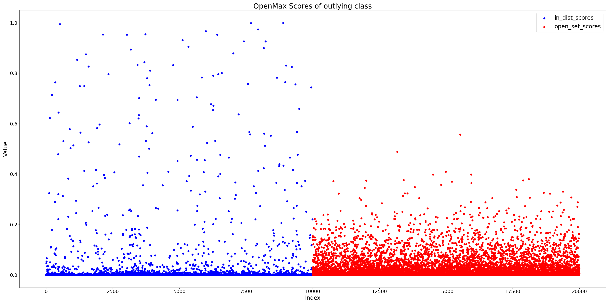
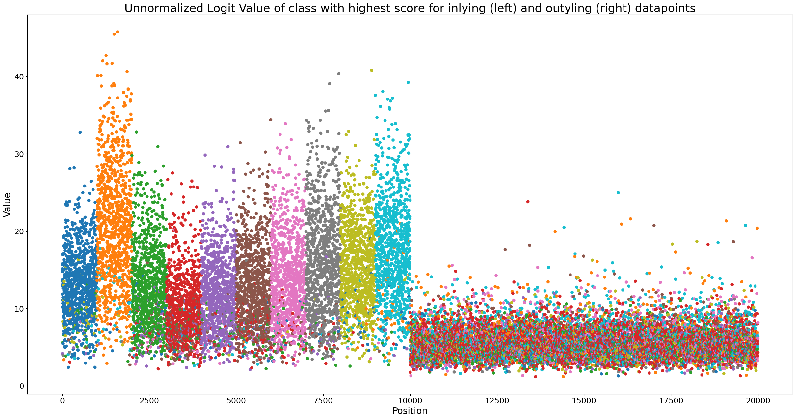
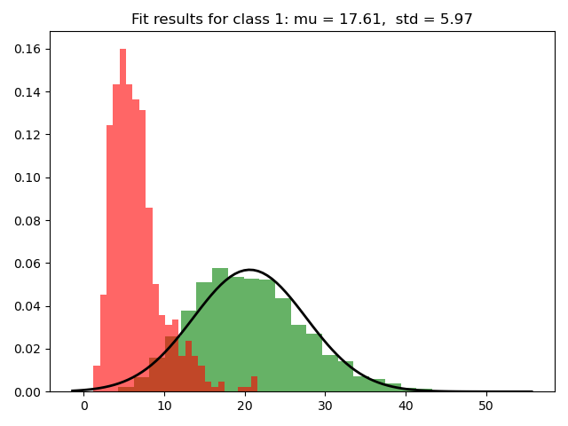
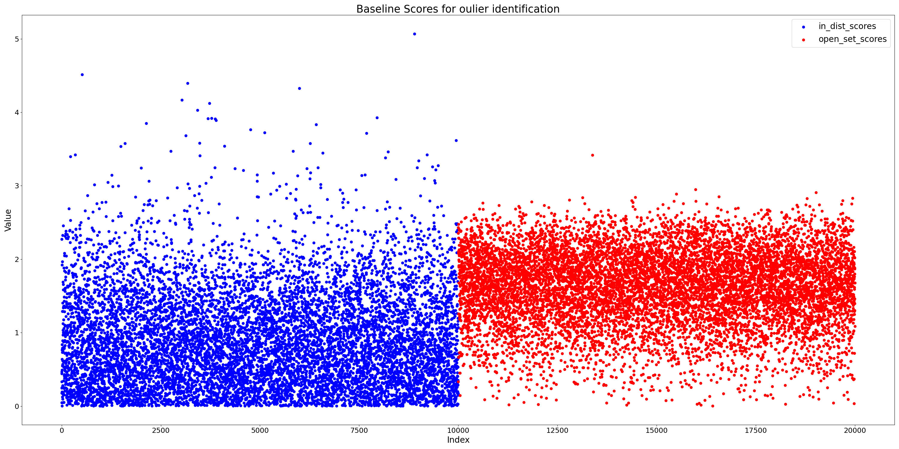
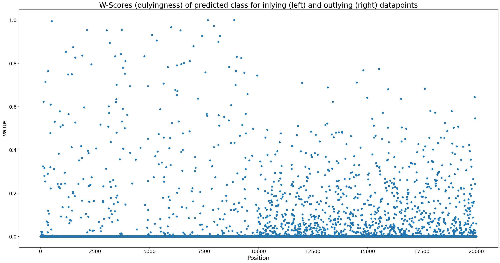
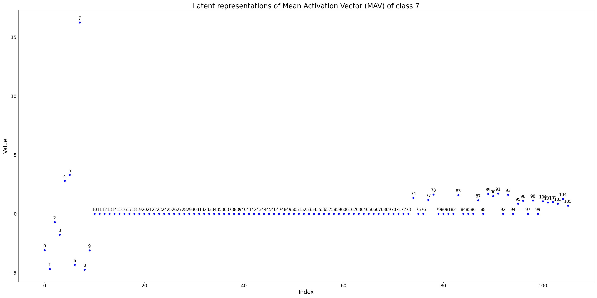

# Classification Reconstruction Open-Set Recognition (CROSR): Python Implementation

This repository aims to provide a lightweighted pytorch implementation of the Classification Reconstruction Open-Set Recognition (CROSR) framework introduced by the following paper: https://arxiv.org/pdf/1812.04246.pdf

## Installation

### Ready-to-use shell-script

To install all packages and download the outyling dataset, you can simply run 

```sh
chmod +x setup.sh 
source setup.sh
```

This will execute a shell-script which handles the whole setup. If anything goes wrong, you can look at the steps below. Especially `LibMR` tends to produce problems, so you might have to install it manually (see below).

Note that `PyTorch` is only installed for CPU-usage, so if you want to train the DHR-Network and have a GPU available, you might want to install the GPU-compatible version of `PyTorch`.

### Packages

To get started, the following packages are required:

- PyTorch: https://pytorch.org/get-started/locally/
- Numpy
- SciPy
- SKlearn
- Tabulate
- Tqdm

All packages are specified in `requirements.txt`. You can install them using either pip or conda or whatever. It it recommended to use a virtual environment.

Additionally, this repository requires LibMR for some stuff. This libary unfortunally does not come out-of-the-box, but you can install with the following steps:

1. Install Cython 
2. Clone the following repository into this projects folder: https://github.com/Vastlab/libMR/tree/master
3. The README of this repository includes a instruction how to install LibMR

FYI: There also seems to be a option to install LibMR using pip (https://pypi.org/project/libmr/), but this did not work for me.

### Datasets

The training of the neural network and the evaluation runs out-of-the-box with CIFAR-10, but it is possible to change the dataset (e.g., MNIST, TinyImageNet, ...). Simply change the torchvision.dataset to the desired one (If it is not supported by torchvision, you need to get creative).

The outlier datasets are downloaded from the following repository: https://github.com/facebookresearch/odin. Without changing anything, the code runs with TinyImageNet (Crop) as outliers (https://www.dropbox.com/s/avgm2u562itwpkl/Imagenet.tar.gz) but the other ones can be downloaded and used as well (just change the hard-coded path in the code).

1. Use wget to download the dataset into the ./data folder: wget https://www.dropbox.com/s/avgm2u562itwpkl/Imagenet.tar.gz 
2. Unpack: tar xvfz Imagenet.tar.gz

## Usage

There are only two scripts so the usage is pretty straight forward:

`train_dhr_nn`: Training script for the Deep Hierarchical Network (DHR) defined in the paper

This repository also provides pre-trained weights: `dhr_net.pt`

```sh
python train_dhr_nn.py
```

`compute_openmax`: The Mean Actiation Vectors (MAV) and distances to those are calculated and used to fit the Meta-Recognition System (MRS) consisting of the Weibull distributions. This is then used to implement the OpenMax framework.

```sh
python compute_openmax.py
```

## Conclusions

### Setting

All the following conclusions are based upon the followin setting:
- We use CIFAR-10 as underlying dataset with 50'000 training images and 10'000 test images of 10 classes (classIDs 0-9)
- We use 10'000 images of ImageNet as outlying images (cropped to be of the same size). We denote their classID as 10.

Based on our experiments, we made several observation which scrutanize/challenge the effectiveness of the CROSR-framework. 

### Summary of results

First of all, we note that the AUROC with ~88.3% can be considered as fairly high. When _only_ looking at the outyling class probabilities (class 10, i.e., the class calculated by OpenMax), it is possible to find a threshold (0.004, see output below) to seperate inlying and outlying images. This is exactly what the AUROC-metrics represents. The following image displays the OpenMax-Scores of of the outlying class for each image. On the left side are the images of the test dataset (first 10'000 values) and on the right side are the images of the outlying dataset (last 10'000 values):



Nevertheless, the CROSR-framework is **not** able to _classify_ outlying images as outliers. While the framework does provide some measure of outlyingness, an image is almost never _actually_ classified as outlier (using the argmax-operand) which yields in a F1-score of 1 % w.r.t. class 10 (refer to the classification report generated by the scikit-learn libary below). This is because the outyling probability is only in a few cases actually the highest value among the class logits. In most of the cases one of the test classes (0-9) still has a higher value. One possible solution of this is calculating the optimal threshold using the Youden's J-statistic for each class and use this threshold instead of the argmax-operand to determine the target class. This approach however might yield in multiple possible classes which is not considered in this setting and might be inpractical in practical environments.

```
  Class    Accuracy    F1-Score using argmax    ROC-AUC    Optimal Cut-Off Threshold    F1-Score using Cut-Off
-------  ----------  -----------------------  ---------  ---------------------------  ------------------------
      0      0.9680                   0.7388     0.9898                       0.1655                    0.6840
      1      0.9700                   0.7590     0.9921                       0.2405                    0.7317
      2      0.9394                   0.5903     0.9718                       0.1709                    0.5048
      3      0.8037                   0.2791     0.8946                       0.0689                    0.2358
      4      0.9579                   0.6835     0.9846                       0.2542                    0.6454
      5      0.9583                   0.6685     0.9740                       0.1080                    0.5659
      6      0.9419                   0.6085     0.9794                       0.4328                    0.6226
      7      0.9826                   0.8417     0.9922                       0.1173                    0.7561
      8      0.9619                   0.7098     0.9894                       0.1991                    0.6588
      9      0.9136                   0.5180     0.9795                       0.4124                    0.5288
     10      0.4973                   0.0055     0.8834                       0.0004                    0.8326
```

In the following we propose an explaination for this behavior. First we are going to recap the basic concept of the CROSR framework.

### Differentiation using the latent embedding space

CSOSR relies on the assumption that inlying and outlying images can be seperated in an _latent embedding space_ created my the Deep Neural Network (in their case Deep Hierarchical Reconstruction Network). This latent embedding space is spanned by the activation vector (AV) of an image which can (but does not have to be as we see later) the output of the final layer of a model. Within this space they calculate the **Mean** Activation Vector (MAV) for all _correctly classfied training_ images for all of the classes. Thus, each class has one MAV. The basic idea now is to utalize the distances of the AV of new images to the MAVs as a measure of oulyingness (larger distances indicate that the image is an outlier).  

Using the logits, i.e., the vector of raw (non-normalized) predictions that the model generates, this framework is based in the assumption that the confidence of the model for outyling images is lower than for inlying images. Lower confidence is indicated by lower logits especially of the predicted class. This general assumption seems to hold in our setting. The following figure displays the values of the logits _only_ of the class with the highest value for each image. The colors refer to the different classes. The test 10'000 test images on the left are in order w.r.t. their class (first 1'000 are of class 0 and so on):



### Basline

A strong baseline compared to this framework would thus be a simple threshold based on the raw predicition values for each class. For comparison, we implemented this baseline by fitting a normal distribution (mean, standard deviation) on the logits for _correctly classified_ training images for each class. For more detail refer to the Jupyter-Notebook `visualizations.ipynb`. First, we show that the prediction values of outyling images of the class with the highest values to follow a different (normal) distribution than the training images:



Next, we calculate the z-score of each images as z_score = (pred_value - class_mean) / class_std, where
- pred_value: Highest logit entry of this image
- class_mean, class_std: Mean and Standard Deviation of the class with the highest raw prediction value of this image  

Using this z-score as measure of outlyingness, we already achieve an AUROC of ~82%!



### Meta-Recognition System of CROSR framework

There are several downsides of this approach, the most proment being that Neural Networks tend to be over-confident in their prediction, resulting in high logit values for images which do not belong to any known class.

The CROSR frameworks fits a Weibull-distribution as Meta-Recognition-System (MRS) which is basically a threshold _for each class_ that represents the maximum distance of an AV to the MAV of this class to be considered as inlier. Rather than returning a binary threshold (0=inlier; 1=outlier), the Weibull-distribition caluclates a w-score (ranges from [0,1]) which can be interpreted as outlying probability of an image w.r.t. a specific class. Note that this oulying probability is always **w.r.t. a specific class**, thus each image has as many w-scores as classes are present in the dataset.

The w-score of an image will be ~1 for all classes except the predicted one because one image can only belong to **one** class (at least in our setting) and _should_ be considered as outlier w.r.t. the other classes. Thus, whether an image should be considered as outlier strongly (if not only) depends on the w-score of the predicted class. Yet, our experiments show that the w-score of the predicted class for outyling datapoints is mostly ~0.



Note the strong similarity between this figure and the figure which displays the OpenMax-Scores of of the outlying class for each image above. Consequently, the distance of oulying images to their (wrongly) predicted class is not high enough because this approach suffers from the same downside as the simple baseline, namely that the model is over-confident in its predictions.

### Using latent feature representation

Contrary to previous work (e.g., the initial OpenMax release: https://arxiv.org/pdf/1511.06233.pdf), the CROSR framework spans the embedding space by _not only_ using the logits but also using latent representations of an image. These latent representation are features of three intermediate layers in the DHRNet aand aim improve the semantic meaning of embedding space.

Our observation and main explaination for the bad performance is that almost all of these latent features are ~0 and do not add any additional information. The following figure displays the MAV of class 7 as an example. The same holds among all classes and can be verified using the Jupyter-Notebook `visualizations.ipynb`:



One additional finding is the strong influence of the parameter `tailsize` of the Weibull-distribution. This parameter defines how many of the largest distances should be used to fit the distrbution. Larger tailsize results in a much better detection of outyling images (True Positives), but also yields many inlying images which are classified as outliers (False Positives).

### Wrap-Up

Let's wrap this up by walking through one example to understand what goes wrong:

    1. The model gets an outlying image and returns an AV. 
    2. In most cases the class with the highest probability is _class 3_ (showed experimentally, refer to `visualizations.ipnyb`). 
    3. Using the AV, we calculate the w-score w.r.t. each class. 
    4. For all classes except for _class 3_, we expect the w-score to be ~1. Whether the datapoint is classified as outlying depends on whether our framework realizes that the datapoint also does not belong to _class 3_. 
    6. Because the latent features are mostly ~0 and our model was over-confident in class 3, the distance to the MAV of class 3 is not very high. This yields in a w-score close to 0 such that the most probable class is still 3.
    7. An additional obstacle is that our model generally seems to struggle with _class 3_. An indicator of this is that class 3 has the lowest prediction values among all classes of the test dataset (refer to `data/plots/activation_values_argmax_unnormalized_values.png`).